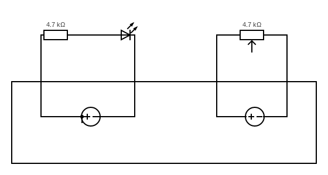
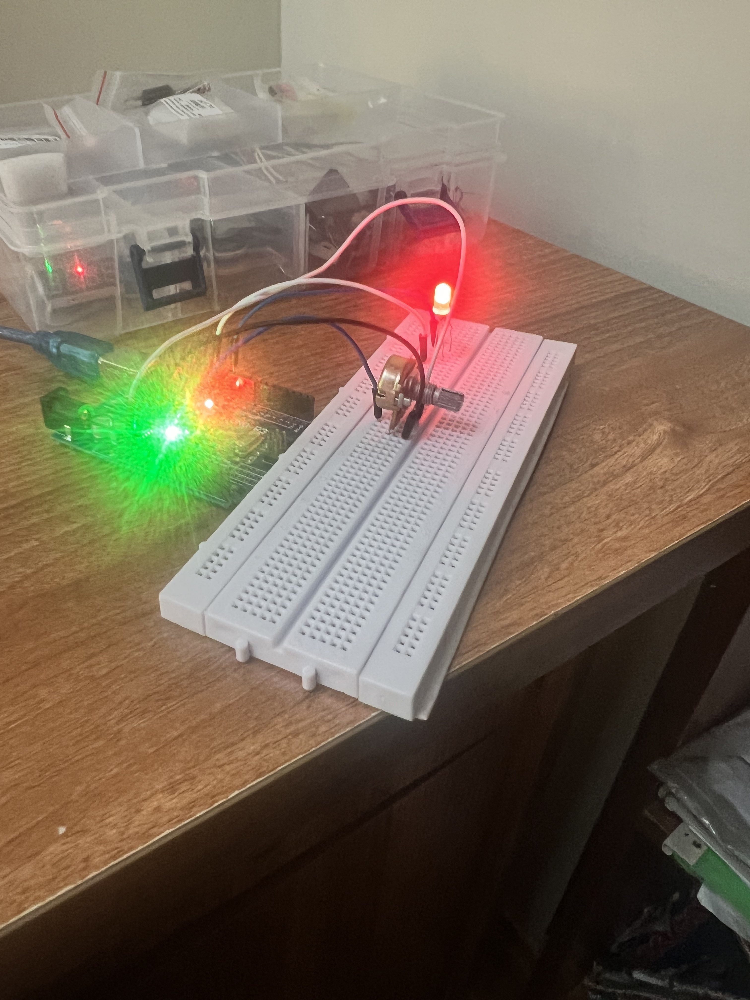

# Overload-Circuit-Warning-Adruino
## Introduction
- According to BBC, electricity is a potent source of energy that can (and does) kill, injure and start fires. 
- Fires in the UK where electricity was believed to be the cause number in the thousands each year. 
- Electrical hazards can be found in all types of workplaces including offices, factories, farms and construction sites
## My Solution
- It is better to create a warning system to automatically alert to the user if there is overloaded electrical device in the home/companies
- The circuit can be built following the diagram below:
- 
- The demostration of circuit system is shown below:
- 
- The Serial monitor to read the value of voltage which is higher than 3 V:
- 
